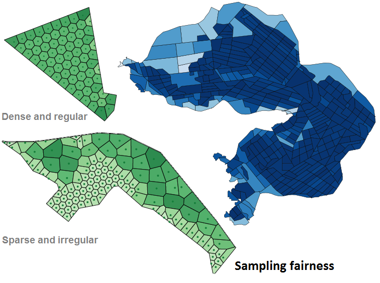
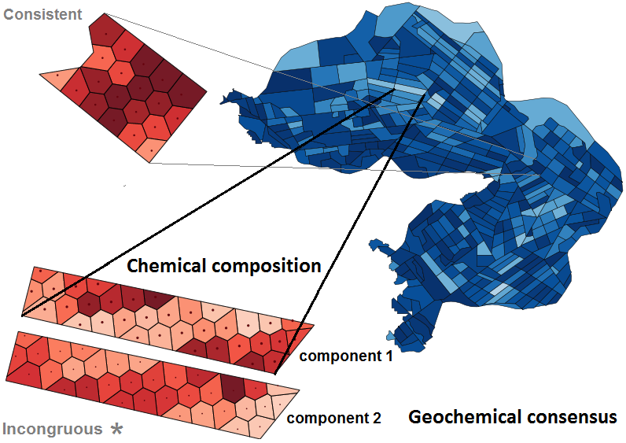

# MSF-GC: Measuring sampling fairness and geochemical consensus for assays in selective mining units

This repository provides an open-source implementation of the methods described in "Measuring sampling fairness and geochemical consensus for blasthole assays within grade-block mining units" (https://engrxiv.org/preprint/view/2422).




### Key words

Data analytics, selective mining units, blasthole assays,
sampling fairness, geochemical consensus, grade control, reliability,
MCD estimator, handling breakdown, split-sequence analysis.

## Audience

- Scientists and Engineers working in _Mining Science and Technology_.
- Researchers and readers of _Computers & Geosciences_, _Mathematical Geosciences_
  or _Earth Science Informatics_.
- People who are thinking of using the MCD estimator to measure robust
  distances in compositional data, who need a way to overcome estimator
  breakdown when there is an unknown level of contamination, where the
  fraction of outliers in a sample may reach as high as 50%.

## Background

In the mining industry, current grade control practices lack a standardised
framework that can assess the reliability of average grade estimates computed
for selective mining units (otherwise known as grade-blocks) within a mining
bench. This python code implements two measures that quantify sampling
fairness and geochemical consensus. The notion of sampling fairness refers to
spatial factors such as sampling density and bias in the spatial distribution
of blastholes whereas geochemical consensus considers the agreement between
the assay measurements within a grade-block. The voronoi image marked with
an asterisk (above) shows a case where there is significant disparity within
a block in terms of geochemistry. Geochemical disparity is measured using the
MCD robust distance estimator and a masking formula that takes into account
the proportion of outliers and magnitude of differences observed above a
threshold. However, the MCD estimator can breakdown in practice when the
fraction of outliers exceeds (n−k−1)/(2n). For k ≥ 2 variables and a sample
size n ≥ 10, this can lead to an underestimation of the true extent and impact
of outliers when they exceed 40%. An extension based on split-sequence analysis
has been proposed to overcome this limitation. The method is evaluated using
anonymised production data from an open-pit iron ore deposit.

## Software implementation

The core algorithm is implemented in two modules:
- `isometric_logratio.py` provides an implementation of ILR transformation.
   It maps compositional data from the Aitchison simplex to Euclidean space
   where differences between two assay samples can be measured by
   Mahalanobis distance.
- `algorithm_implementation.py` computes the sampling fairness and
   geochemical consensus measures. It also implements split-sequence analysis
   which handles estimator breakdown. The API has the following signature:
```
run(self, gb_polygon, gb_holes_xy, gb_chemistry, results, randseeds=[8365])
```
- Required parameters:
  - `gb_polygon` (shapely.geometry.Polygon) represents the 2D grade-block boundary
  - `gb_holes_xy` (numpy.array) denotes blasthole coordinates, shape: (n,2)
  - `gb_chemistry` (numpy.array) denotes assay measurements, shape: (n,m)
  - `results` (dict) report the spatial confidence and geochemical consensus scores along with other statistics
- Optional parameter:
  - `randseed` list(int) usually a single random seed \[ _integer_ \] is supplied for reproducibility

Other modules:
- `custom_graphs.py` provides methods for 
  - drawing block boundaries (polygon regions) and displaying attributes in a colour map.
  - producing ternary plots: converting 3D composition vectors to 2D canvas coordinates.
  - these features are shown in `evaluate.ipynb` and `validation.ipynb`

## Test data

- `data/blasthole_assays.csv` provides some test data used in `example.py`
  - `x`, `y`, `z` describe the center coordinates of blastholes in an arbitrary frame
  - `c1`, `c2`, `c3` describe the normalised concentration of three chemical components
  - `gradeblock_id` identifies the grade-block associated with these assay samples.
- `data/gradeblock_geometries.csv` describes the shape of two grade-blocks
  - `gradeblock_id` allows a particular grade-block to be linked to blastholes
  - `name` is just a more human-friendly identifier
  - `boundary` represents a shapely polygon string in wkt format.
- `data/high_breakdown.csv` is used to illustrate the estimator
   breakdown phenomenon. The intermediate steps and output are traced in the
   example given in Section 4.2 of the paper.
- `data/anonymised_*.csv` and `data/synthesized_samples.zip` are used in `evaluate.ipynb`
   and `validation.ipynb` to replicate experiments and reproduce figures in the paper.

## Requirements

- Python version 3.7.2+

### Packages

- jupyter ≥ 1.0.0
- matplotlib ≥ 3.3.4
- numpy ≥ 1.19.2
- pandas ≥ 1.3.2
- scipy ≥ 1.6.1
- scikit-learn ≥ 0.24.1
- shapely ≥ 1.7.1

To install requirements (this may not be necessary):

```setup
pip install -r requirements.txt
```

For Anaconda users:
```setup
conda env create -n msfgc -f environment.yml
```

## Usage

To replicate results for the examples shown in Table 2 and Sec. 4.2 of the paper, run:

```eval
python example.py
```

## Reference

This work may be cited as:
- Raymond Leung, "Measuring sampling fairness and geochemical consensus for blasthole
  assays within grade-block mining units," Computers & Geosciences, 2023.
  DOI: https://doi.org/10.1016/j.cageo.2022.105286. 
  Open-source implementation is available at https://github.com/raymondleung8/sampling-fairness-geochemical-consensus
  under a GPL-3.0 license.
- The BibTeX entry may be copied from [here](citation.bib).


## License

>📋  This project is licensed under the terms of the [GPL-3.0](LICENSE.md) license.

MSF-GC. Measuring sampling fairness and geochemical consensus for assays in selective mining units. Copyright (C) 2022 Raymond Leung.
 
This program is free software: you can redistribute it and/or modify it under the terms of the GNU General Public License as published by the Free Software Foundation, either version 3 of the License, or (at your option) any later version.
 
This program is distributed in the hope that it will be useful, but WITHOUT ANY WARRANTY; without even the implied warranty of MERCHANTABILITY or FITNESS FOR A PARTICULAR PURPOSE.  See the GNU General Public License for more details.
 
You should have received a copy of the GNU General Public License along with this program.  If not, see https://www.gnu.org/licenses/.
 
Further information about this program can be obtained from:

- Raymond Leung (raymond.leung@sydney.edu.au)
 
